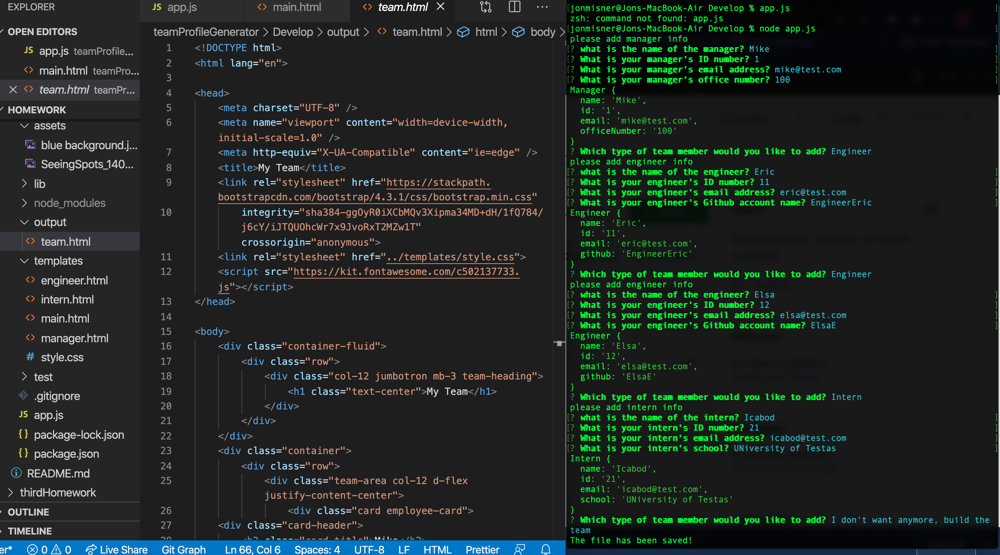

 # Team Profile Generator  
***
 
  ## Description

    Dynamically generate a quick profile for members of a development team.
***

    
  

***

  ## Table of Contents

  * [Description](#description)
  * [Installation](#installation)
  * [Usage](#use)
  * [Contributors](#contributors)
  * [Contact Information](#email)
  * [License](#license)
***

  ## Installation

    To install necessary dependencies, run the following command:
  
     Run "npm install" to get required node modules.
***

  ## Usage

     Enter "app.js" in the command line
***

  ## Tests

  To run tests, run the following command:
  
     Enter "npm test" to run tests
***

  ## Contributors

     Created by Jon Misner
     Code advice from Joseph Young
***

  ## Contact Information

     Github: jonmisner or jonmisner86@gmail.com
***
